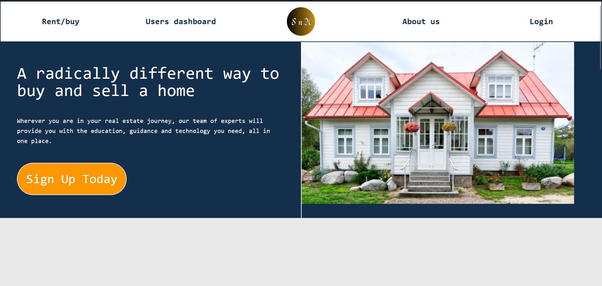
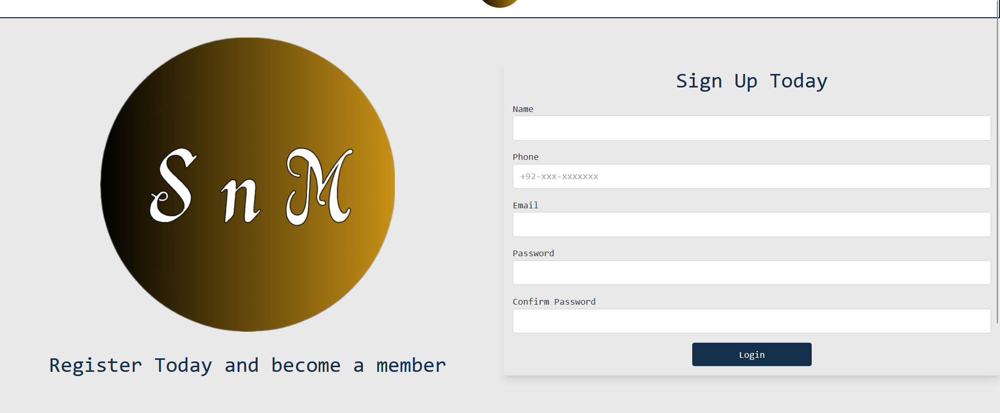
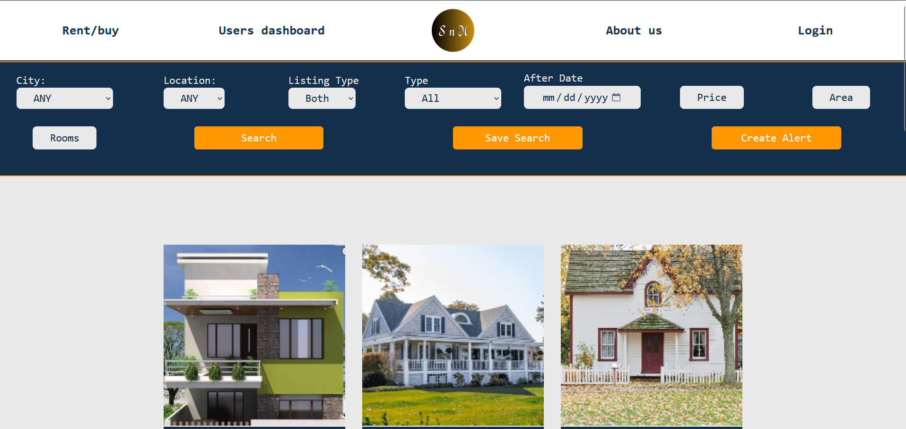
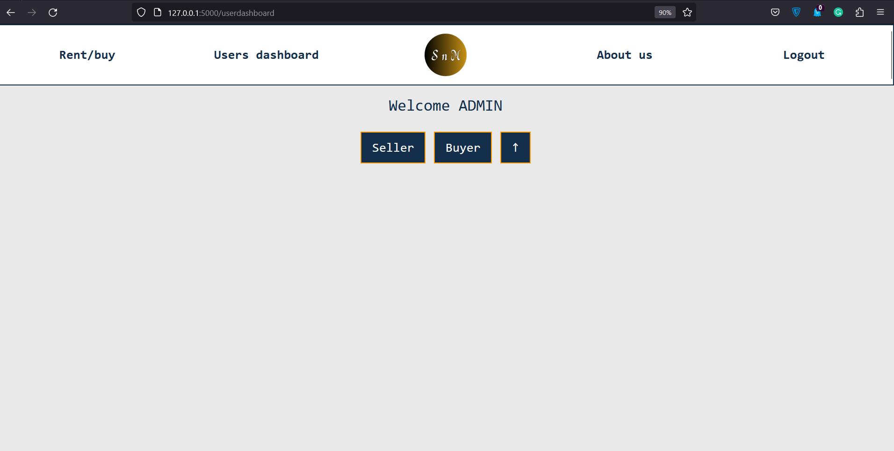
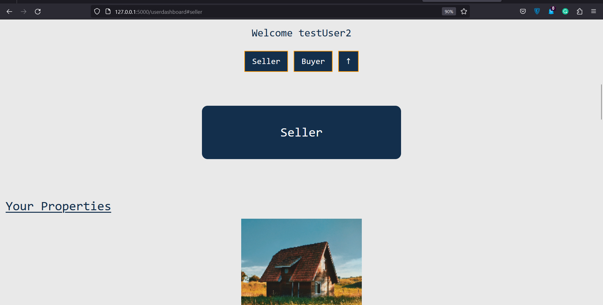
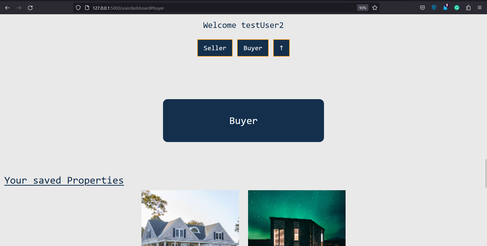
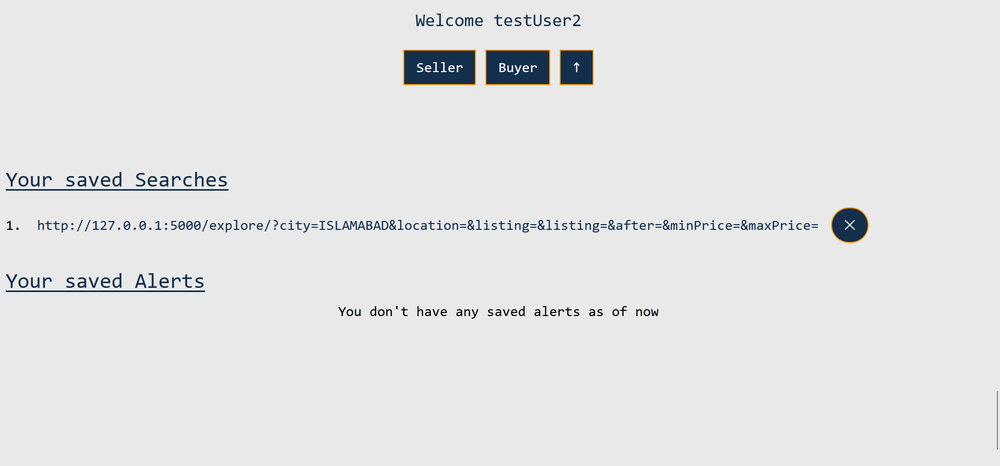
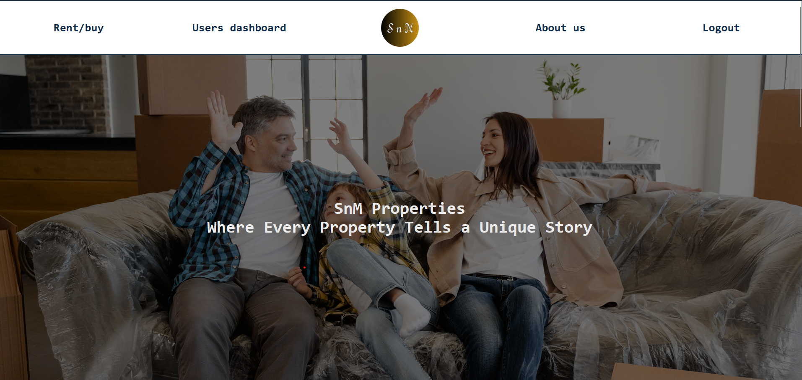

# Property Rent/Purchase Site

This project is a demonstration of a Property Rent/Purchase Site built using Flask, a web framework in Python. It showcases various features and functionality to simulate a platform that connects property owners and tenants/buyers.

[Github](https://github.com/SajeelHashmi/Flask-REAL-ESTATE-WEBSITE)

---

## Features

1. **Property Listings:** The project includes a database of properties available for rent or purchase. Each listing contains essential information such as property description, amenities, pricing, and contact details of the owner/agent.

2. **Search and Filters:** Users can search for properties based on location, property type, price range, number of bedrooms/bathrooms, and more. The project provides a search functionality with filters to refine the search results.

3. **User Accounts:** Users can create accounts to access additional features. They can save their favorite listings, save search history, and receive email alerts for new properties that match their criteria.

4. **Property Submission:** Registered users can list their properties for potential customers to view.

5. **Email Alerts:** Users can choose to check alerts explicitly when logged in, or the system can automatically check at a specific time. To set the automatic check, the server needs to be configured to run the `emailAlerts.py` script at the dedicated time. This separation of email alerts ensures scalability as Flask is not an asynchronous framework.

---

## Pages and Features Showcase

Here are some of the key pages and features of the Property Rent/Purchase Site:

### Landing Page

The home page provides an overview of the platform and showcases featured properties, testimonials, and encourages users to sign up.

### Signup Page

The signup page where a user can register and unlock many privileges

### Explore

The explore page includes the property search functionality, allowing users to specify their criteria and find properties that match their preferences. The search results are displayed in an organized manner, making it easy for users to explore available options. This page also allows logged-in users to save their searches, create alerts, and save properties.

### Property Details

Each property listing has a dedicated page with comprehensive details about the property. Users can view images, read the property description, check amenities, and get in touch with the property owner/agent for more information.

### User Dashboard

Users can create accounts on the platform to access additional features. With a user account, they can list their properties, save their favorite listings, save search history, and receive email alerts for new properties that match their criteria.

### About Us

A static page providing information about the website, including its mission and values.

---

## Getting Started

To explore and run this Property Rent/Purchase Site project, follow these steps:

1. **Create a Virtual Environment:** Set up a virtual environment for the project to maintain an isolated Python environment. Use tools like `venv` or `virtualenv` to create and activate the virtual environment.

2. **Download Requirements.txt:** Install the required Python packages by executing the following command in the project directory:

        pip install -r requirements.txt
        

3. **Download Package.json:** Ensure that you have a file named "package.json" in your project directory.

        npm install
        

4. **Configure Email Alerts:**

- Open the "email_alerts.py" file in your project.
- Add your email username to the `sender` variable and your app password to the `password` variable.
- Save the changes.

5. **Create a Database:**

- Configure your database and connection in the `conn.py` file.

6. **Run the Application:**

- Open your terminal or command prompt.
- Make sure your virtual environment is activated.
- Run the following command to start the application:

        python app.py

The Property Rent/Purchase Site should now be running locally on your machine. Access it through your web browser at `http://localhost:5000` or the specified address in the terminal.

---

## Technologies Used

This Property Rent/Purchase Site project utilizes a range of technologies to deliver its features and functionality. The following technologies were used in the development of this project:

- **Python:** The backend of the project is built using Python, a versatile and powerful programming language.

- **Flask:** Flask, a lightweight web framework, is used to develop the web application, handle routing, and manage server-side logic.

- **smtplib:** The `smtplib` library in Python is employed for sending email alerts to users, ensuring efficient communication.

- **SQL:** Structured Query Language (SQL) is used to manage the project's database, allowing efficient storage and retrieval of property listings, user data, and other relevant information.

- **JavaScript:** JavaScript is utilized to enhance interactivity and provide dynamic features on the client-side of the web application.

- **HTML:** HTML (HyperText Markup Language) is used for structuring the web pages and defining the content.

- **Tailwind CSS:** Tailwind CSS, a utility-first CSS framework, is utilized for styling the web application and achieving a clean and responsive design.

- **Croppie.js:** Croppie.js is employed to provide image cropping functionality, allowing property owners/agents to crop and upload images of their properties.

These technologies were chosen for their compatibility, efficiency, and ability to deliver a seamless user experience in the Property Rent/Purchase Site project.

Feel free to explore and experiment with this Property Rent/Purchase Site project. It demonstrates the features typically found in a property rental/purchase website and highlights the skills involved in building such a platform.

The Property Rent/Purchase Site should now be running locally on your machine. Access it through your web browser at `http://localhost:5000` or the specified address in the terminal.

Feel free to explore and experiment with this Property Rent/Purchase Site project. It demonstrates the features typically found in a property rental/purchase website and highlights the skills involved in building such a platform.

